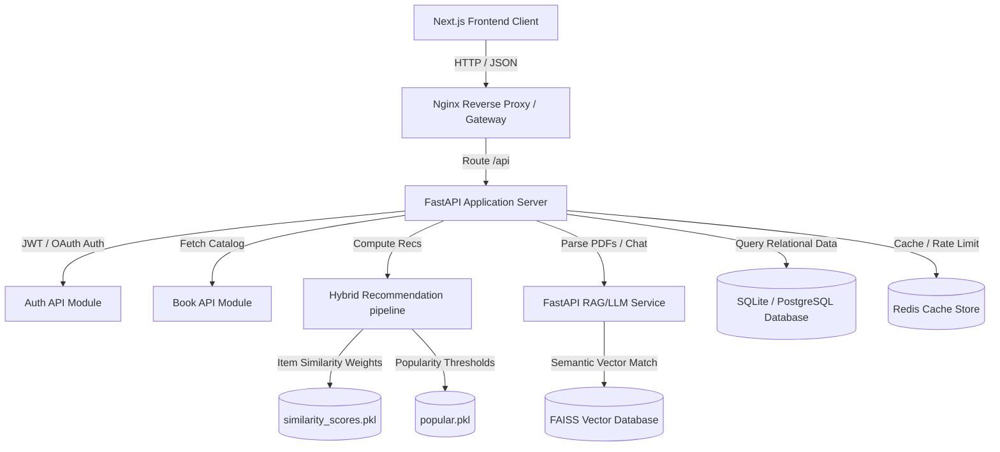
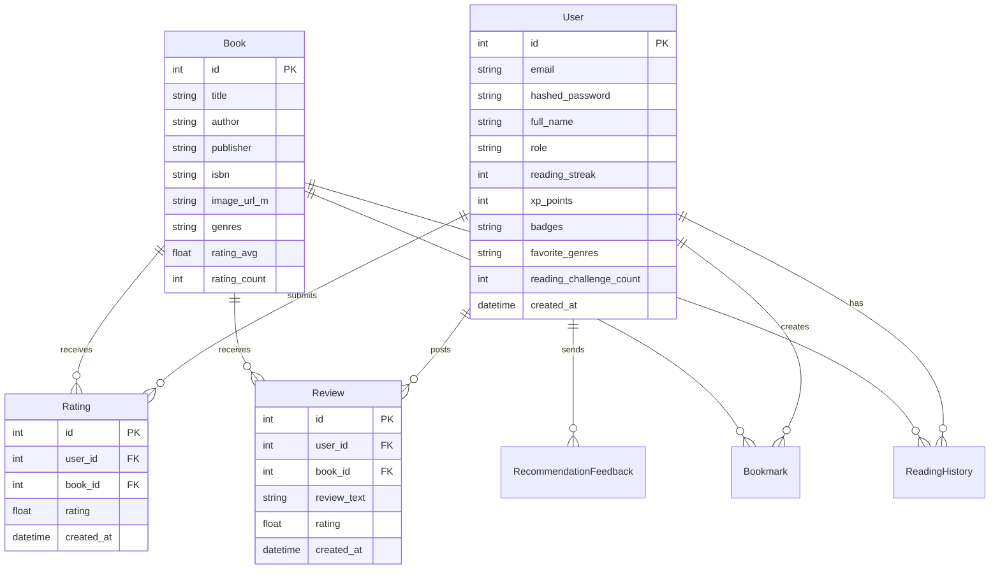
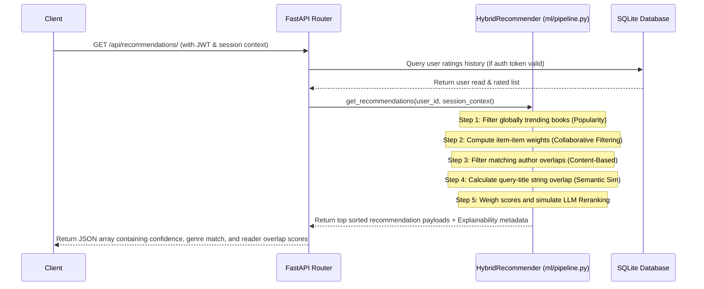

# NextGen Reads AI - System & Architecture Documentation

NextGen Reads AI is an enterprise-grade AI-powered Book Recommendation Platform built on microservice principles with FastAPI and Next.js.

---

## 1. System Architecture Diagram



---

## 2. Entity-Relationship (ER) Diagram



---

## 3. Recommendation Pipeline Flow



---

## 4. API Documentation

| Endpoint | Method | Authentication | Description |
|---|---|---|---|
| `/api/auth/register` | POST | None | Create a new user profile with favorite genres. |
| `/api/auth/token` | POST | None | Verify password credentials and retrieve JWT token. |
| `/api/auth/me` | GET | JWT | Fetch authenticated user's profile details. |
| `/api/books/` | GET | None | Get paginated book catalog list, filterable by genre/author. |
| `/api/books/{id}/reviews` | POST | JWT | Add a text review and rating, incrementing user XP. |
| `/api/recommendations/` | GET | Optional JWT | Retrieve hybrid personalized list containing confidence explanations. |
| `/api/chat/` | POST | JWT | Conversational interface with AI reading coach. |
| `/api/chat/rag/upload` | POST | None | Upload PDF summary, parse content, and index vectors. |
| `/api/chat/rag/query` | POST | None | Query vectorized PDF context. |
| `/api/analytics/dashboard` | GET | JWT | Fetch MAU, DAU, and CTR stats for charts. |

---

## 5. Deployment Guide

### Requirements
- Docker & Docker Compose
- Node.js (v20+) & npm
- Python (v3.12+)

### Running Locally with Docker Compose
1. Navigate to the deployment folder:
   ```bash
   cd deployment
   ```
2. Start all microservices in the background:
   ```bash
   docker-compose up --build -d
   ```
3. The platform will be active on:
   - Next.js Client: `http://localhost:3000`
   - FastAPI swagger: `http://localhost:8000/docs`
   - Nginx server proxy: `http://localhost:80`
